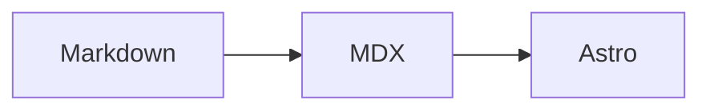

import Callout from '../../src/components/Callout.astro';

## MDX Fixture

<Callout title="승인된 컴포넌트">
  이 문서는 production 목록에 노출되지 않지만 MDX 통합과 로컬 컴포넌트 import를 build에서 검증합니다.
</Callout>

```mermaid
flowchart LR
  Markdown --> MDX
  MDX --> Astro
```
