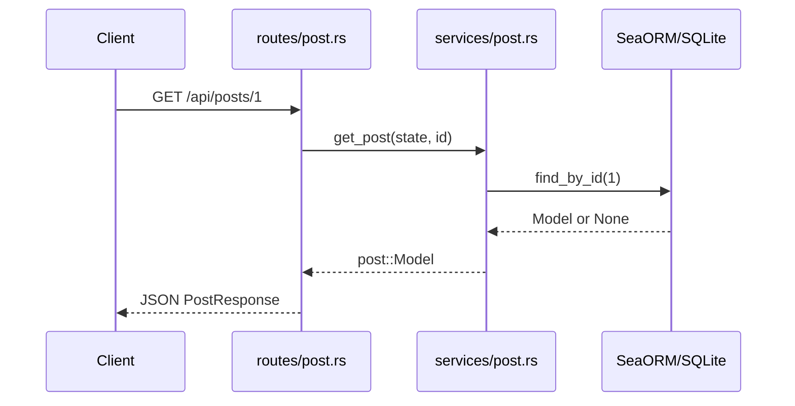

이 시리즈는 `content/backend/rust/board-api`에 있는 **Rust 게시판 백엔드**를 한 줄씩 읽으며 배우는 글입니다. 프로그래밍 경험은 있지만 Rust는 처음인 분을 대상으로, Java·Python과 비교하는 설명을 곁들입니다.

## 이 프로젝트가 하는 일

`board-api`는 **게시글 CRUD**를 제공하는 웹 서버입니다. 같은 비즈니스 로직으로 두 가지 UI를 지원합니다.

| 방식 | 접근 예 | 용도 |
|------|---------|------|
| **REST API** | `curl`, 프론트엔드 SPA | JSON으로 데이터 주고받기 |
| **HTML UI** | 브라우저 `http://127.0.0.1:3000` | 서버가 HTML을 렌더링해 게시판 화면 제공 |

Spring Boot에서 `@RestController`와 `@Controller`를 나눠 쓰는 것과 비슷합니다. Rust에서는 `routes/post.rs`(REST)와 `routes/web.rs`(HTML)로 역할이 나뉩니다.

## 기술 스택

| 구분 | 라이브러리 | 비고 |
|------|------------|------|
| HTTP | Axum 0.7 | Tokio 위의 웹 프레임워크 (Express/FastAPI 느낌) |
| ORM | SeaORM 1.x + SQLx | SQLite용 |
| DB | SQLite (`board.db`) | 파일 하나로 동작, 학습·로컬에 적합 |
| 템플릿 | Askama 0.12 | 컴파일 타임 HTML 템플릿 (Jinja2 유사) |
| 비동기 | Tokio | `async`/`await` 런타임 |

## 프로젝트 구조

```
board-api/
├── Cargo.toml          # 의존성·crate 설정
├── src/
│   ├── main.rs         # 서버 진입점 (바이너리)
│   ├── lib.rs          # 라이브러리 루트 (테스트에서 재사용)
│   ├── db.rs           # DB 연결·스키마
│   ├── state.rs        # AppState (DB 핸들 공유)
│   ├── entity/post.rs  # posts 테이블 ↔ Rust 타입
│   ├── services/post.rs# CRUD·검증 (API·웹 공용)
│   ├── dto/            # 요청/응답 JSON·폼 구조체
│   ├── error.rs        # AppError
│   ├── routes/         # URL → 핸들러
│   └── web/            # HTML 뷰·템플릿 바인딩
├── templates/          # Askama HTML
└── tests/              # 통합 테스트
```

**레이어 책임**을 한 줄로 정리하면 다음과 같습니다.

- **routes**: HTTP 메서드·경로와 핸들러 연결
- **services**: 비즈니스 규칙·DB 접근
- **entity**: 테이블 행의 타입
- **dto / web**: 외부(JSON·폼)와 내부(Model) 사이 변환

## HTTP 요청의 전체 여정

한 번의 `GET /api/posts/1` 요청이 코드 안에서 어떻게 흐르는지 그려 보면 다음과 같습니다.



1. **클라이언트**가 HTTP 요청을 보냅니다.
2. **Axum 라우터**(`routes/mod.rs`)가 URL에 맞는 핸들러(`get_post`)를 고릅니다.
3. 핸들러는 **AppState**에서 DB 연결을 꺼내 **서비스**를 호출합니다.
4. **서비스**가 SeaORM으로 SQLite를 조회합니다.
5. 결과 **Model**을 **PostResponse** DTO로 바꿔 JSON으로 응답합니다.

HTML 경로(`GET /posts/1`)도 **서비스는 동일**하고, 마지막에 Askama 템플릿으로 HTML만 다르게 만듭니다. 이 점은 07·10·11편에서 반복해서 다룹니다.

## REST vs 웹 경로

| Method | REST | HTML |
|--------|------|------|
| 목록 | `GET /api/posts` | `GET /` |
| 상세 | `GET /api/posts/:id` | `GET /posts/:id` |
| 생성 | `POST /api/posts` (JSON) | `POST /posts` (폼) |
| 수정 | `PUT /api/posts/:id` | `POST /posts/:id/edit` |
| 삭제 | `DELETE /api/posts/:id` | `POST /posts/:id/delete` |
| 헬스 | `GET /health` | — |

## 실습: 서버 띄우고 흐름 확인하기

```bash
cd content/backend/rust/board-api
cp .env.example .env   # 선택
cargo run
```

다른 터미널에서:

```bash
# 헬스 체크 → 라우터·핸들러까지 도달
curl http://127.0.0.1:3000/health

# 게시글 생성 → routes → services → DB
curl -X POST http://127.0.0.1:3000/api/posts \
  -H 'Content-Type: application/json' \
  -d '{"title":"첫 글","content":"본문","author":"dev"}'

# 브라우저에서 HTML UI
# http://127.0.0.1:3000
```

`health`가 `ok`이면 서버·라우팅이 동작하는 것이고, POST 응답에 `id`가 있으면 DB까지 한 바퀴 돈 것입니다.

## 시리즈 읽는 순서

`doc-plan.md`에 정리된 대로 **00(이 글) → Rust 문법(01~03) → 서버 뼈대(04~05) → DB·서비스(06~07) → API·에러·DTO(08~10) → HTML·테스트(11~12) → 전체 정리(13)** 순으로 읽으면 `board-api` 전체 소스를 따라갈 수 있습니다.

다음 글에서는 `Cargo.toml`과 `lib.rs`의 **모듈 시스템**부터 살펴봅니다.
