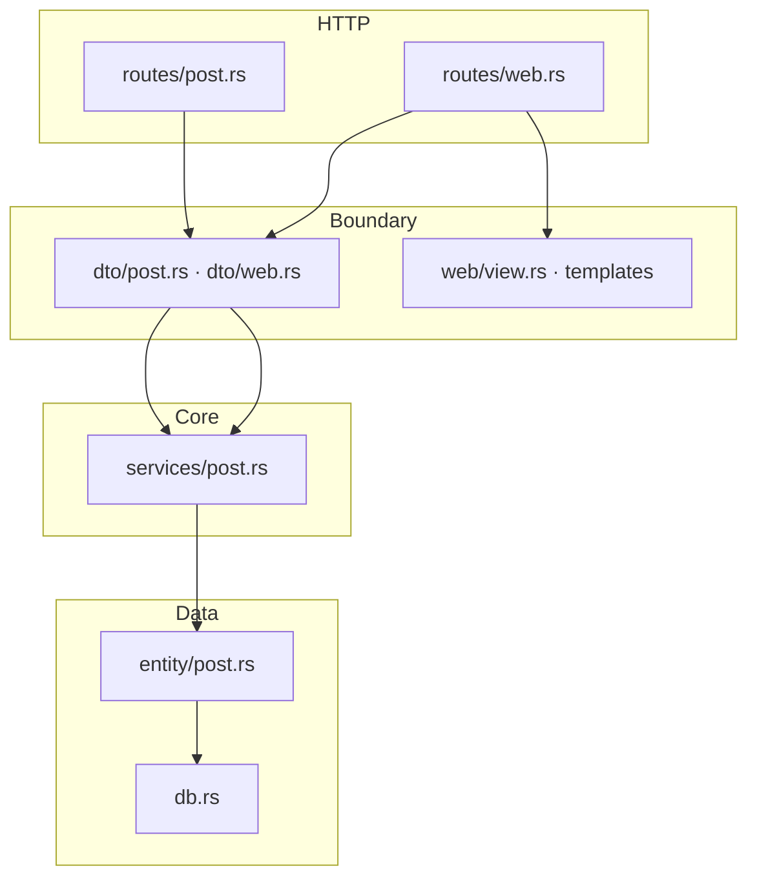

00~12편을 거치며 `board-api`의 소스·템플릿·테스트를 한 줄씩 따라왔습니다. 이 글은 **전체 지도**로 복습하고, “글 하나가 저장되기까지” 한 요청의 여정을 다시 연결합니다.

## 레이어 책임 (최종)



| 레이어 | 파일 | 책임 |
|--------|------|------|
| **routes** | `routes/mod.rs`, `post.rs`, `web.rs` | URL, extractor, 응답 형식(Json/Html/Redirect) |
| **dto / web** | `dto/*`, `web/*` | 외부 입력·출력 형식 |
| **services** | `services/post.rs` | CRUD, 검증, 트랜잭션적 흐름 |
| **entity** | `entity/post.rs` | 테이블 ↔ Rust 타입 |
| **db** | `db.rs` | 연결, 스키마 |
| **error** | `error.rs` | `AppError`, HTTP 변환 |
| **state** | `state.rs` | 요청 간 공유 `DatabaseConnection` |

## REST vs Web — 같은 심장, 다른 피부

| | REST (`/api/posts`) | Web (`/posts`, `/`) |
|---|---------------------|---------------------|
| 입력 | `Json<CreatePostRequest>` | `Form<PostForm>` → DTO |
| 출력 | `Json<PostResponse>` | Askama `Html` |
| 에러 | JSON `{ "error": ... }` | HTML 에러 페이지 또는 폼 재표시 |
| 삭제 | `DELETE` | `POST .../delete` |

**07·10·11편**에서 강조한 대로 `services/post.rs`는 **한 벌**입니다.

## 한 글 작성의 여정 (HTML)

브라우저가 새 글 폼을 제출할 때:

1. **POST /posts** — `routes/web.rs` `create_post`
2. `Form<PostForm>` → `into_create_request()`
3. `services::create_post` — `validate_create`, `ActiveModel::insert`
4. SeaORM → SQLite `posts` 행 추가
5. 성공 시 **Redirect** `/posts/{id}`
6. **GET /posts/{id}** — `get_post` → `DetailTemplate` 렌더

JSON API는 3~4까지 동일하고, 5~6 대신 **JSON PostResponse**를 반환합니다.

## 한 글 작성의 여정 (REST)

```bash
POST /api/posts → routes/post.rs → services → DB
← 200 JSON PostResponse
```

`tests/api.rs`가 이 경로를 `oneshot`으로 검증합니다.

## 시리즈에서 다룬 Rust·생태계

| 편 | 주제 |
|----|------|
| 00 | 개요·스택 |
| 01 | Cargo, mod |
| 02 | struct, enum, impl |
| 03 | Option, Result, ? |
| 04 | Tokio, main |
| 05 | AppState, Router |
| 06 | SeaORM, db |
| 07 | 서비스 CRUD |
| 08 | thiserror |
| 09 | Serde DTO |
| 10 | REST 핸들러 |
| 11 | Askama |
| 12 | 통합 테스트 |
| 13 | 이 글 — 복습 |

## 실행·테스트 체크리스트

```bash
cd content/backend/rust/board-api
cargo test
cargo run
# REST
curl http://127.0.0.1:3000/health
# Web
# 브라우저 http://127.0.0.1:3000
```

Docker: `docker compose up --build` (README 참고).

## 확장 아이디어

학습용 `board-api`를 실서비스에 가깝게 키울 때 자주 붙는 기능입니다.

| 아이디어 | 건드릴 레이어 |
|----------|----------------|
| **페이지네이션** | `list_posts` + `ListTemplate` + 쿼리 `?page=` |
| **인증/세션** | middleware, `AppState`에 세션, routes 보호 |
| **댓글** | 새 `entity`, `services`, routes |
| **마이그레이션** | `sea-orm-cli` migrate, `init_schema` 대체 |
| **OpenAPI** | `utoipa` 등 + `routes/post.rs` 문서화 |

## 부록: Docker (선택)

`Dockerfile` — 멀티 스테이지로 release 빌드 후 slim 이미지.  
`docker-compose.yml` — `HOST=0.0.0.0`, volume `board-data`에 SQLite.

로컬 학습에는 `cargo run`만으로 충분하고, 배포 연습 시 Docker를 쓰면 됩니다.

## 마치며

이 시리즈의 목표는 **Axum + SeaORM 게시판 예제의 모든 파일을 스스로 설명할 수 있는 것**이었습니다. 새 코드를 읽을 때는 항상:

1. URL이 어느 **route**인지
2. **service**에 무엇을 맡기는지
3. **entity/db**에서 어떻게 persist하는지

세 단계만 기억하면 됩니다. 시리즈 계획은 `blog/doc-plan.md`에 그대로 두었으니, 글을 수정·추가할 때 표를 함께 갱신하면 됩니다.
